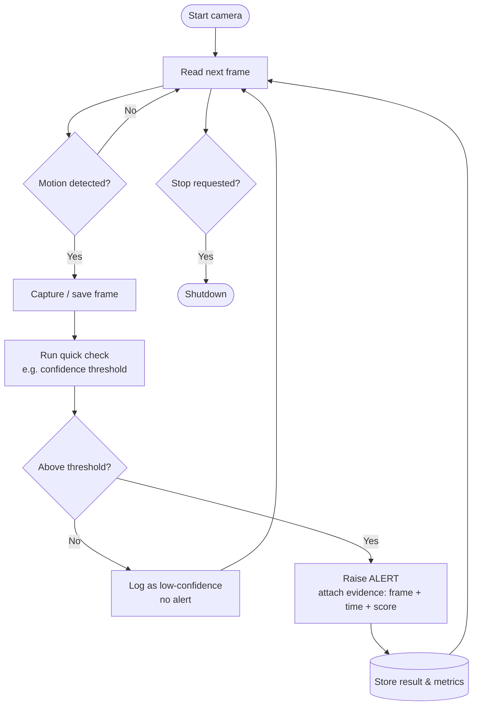

# Week 1 Lab — Camera Alert Flowchart

A flowchart for a motion-triggered camera alert. The rule taught in Week 1:
*"if motion is detected, capture a frame; otherwise keep waiting."*

This is the **event-driven loop** that the whole Uni_Vision pipeline later sits on top of.

## Flowchart (Mermaid)



## Plain-text version (for graders who can't render Mermaid)

```
START
  |
  v
READ NEXT FRAME  <-------------------+
  |                                  |
  v                                  |
[ Motion detected? ] --No----------->+
  | Yes                              |
  v                                  |
CAPTURE / SAVE FRAME                 |
  |                                  |
  v                                  |
RUN QUICK CHECK (threshold)          |
  |                                  |
  v                                  |
[ Above threshold? ] --No--> LOG ----+
  | Yes                              |
  v                                  |
RAISE ALERT (frame + time + score)   |
  |                                  |
  v                                  |
STORE RESULT & METRICS --------------+
```

## Why this shape
- The **loop** back to *Read next frame* is what keeps the camera live.
- *Motion detected?* and *Above threshold?* are **conditions** — the two decisions the system makes.
- The arriving frame / motion crossing the line is the **event** that drives everything.
- `confidence threshold` and `last_alert_time` are the **variables** the system remembers.
- Every alert carries **evidence** (frame + time + confidence). Provenance is taught early in
  Uni_Vision: *every AI output should have evidence, time, source, and confidence.*
